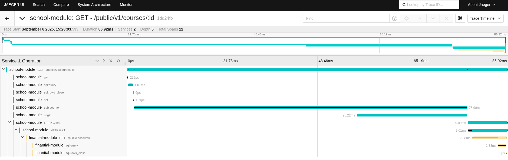

import useBaseUrl from '@docusaurus/useBaseUrl';

Visão geral
===========

<!-- truncate -->

Este post demonstra como habilitar e explorar monitoramento tracing em um projeto Golang que utiliza o SDK colibri-sdk-go. Usaremos o stack OpenTelemetry (OTel) com Collector, Prometheus e um visualizador de traces (por exemplo, Jaeger ou Tempo/Grafana). O repositório de exemplo possui dois módulos (school-module e finantial-module) e um ambiente docker-compose para facilitar a execução local.

Estrutura do exemplo
--------------------

- Módulos de exemplo:
  - school-module
  - finantial-module
- Serviços de apoio (dev/):
  - otel-collector
  - localstack
  - postgres

Pré‑requisitos
--------------

- Docker e Docker Compose
- Go 1.24+
- Make

Como subir o ambiente de observabilidade
----------------------------------------

O projeto já fornece um docker-compose com os serviços necessários prontos para uso.

1. Compile os projetos com o comando:
```shell
make build
```
2. Suba os serviços de infraestrutura com o comando:
```shell
make start
```
3. Acesse o Jeager na url http://localhost:16686/

Configuração OpenTelemetry no SDK
---------------------------------

O SDK colibri-sdk-go já inclui integração com OTel. Veja o arquivo:
- pkg/base/monitoring/colibri-otel/open_telemetry.go (no repo colibri-sdk-go)

Os módulos de exemplo consomem essa configuração. Ao iniciar cada serviço, o SDK inicializa o provedor de traces e exportadores conforme as variáveis de ambiente.

Variáveis de ambiente relevantes (exemplos)
-------------------------------------------

- OTEL_EXPORTER_OTLP_ENDPOINT: apontar para o Collector (ex.: http://otel-collector:4317)
- OTEL_SERVICE_NAME: nome do serviço (ex.: school-api)
- OTEL_RESOURCE_ATTRIBUTES: atributos extras (ex.: deployment.environment=dev)
- COLIBRI_LOG_LEVEL: nível de log

Confira os arquivos .env em cada módulo:
- school-module/.env
- finantial-module/.env

Gerando tracing
----------------------------

- Crie um curso no school-module:
```shell
curl --request POST \
  --url http://localhost:8080/public/v1/courses \
  --header 'Content-Type: application/json' \
  --data '{"name": "Course 001","value": 100}'
```

- Com o id retornado na criação do curso, execute uma busca:
```shell
curl --request GET --url http://localhost:8080/public/v1/courses/fe6fa672-8ce0-11f0-a8e8-a3ca18a3537e
```

- Para mais requests veja a documentação dos projetos:
  - School Swagger UI: http://localhost:8080/swagger/index.html
  - Financial Swagger UI: http://localhost:8081/swagger/index.html

- Acesse o Jaeger na url http://localhost:16686/ e veja os traces gerados.

Explorando métricas e traces
----------------------------

Exemplo de tracing para a chamada REST de busca de curso por id:


Boas práticas
-------------

- Nomeie OTEL_SERVICE_NAME por módulo para facilitar filtros.
- Propague context.Context em toda a call stack.
- Anexe atributos-chave (user_id, order_id) como span attributes quando relevante.
- Defina sampling apropriado no Collector para ambientes de produção.
