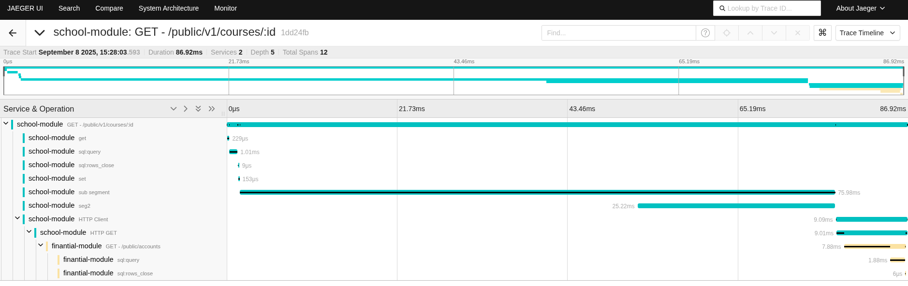

Learn in minutes how to instrument your Go services with colibri-sdk-go and OpenTelemetry. Spin up the stack with docker-compose, configure environment variables, and visualize your traces in Jaeger — with practical examples, real-world modules, and tips for end-to-end observability best practices.

<!-- truncate -->

## Example Structure

- [GitHub](https://github.com/colibriproject-dev/colibri-sdk-go-examples)

- Example modules:
  - school-module
  - financial-module
- Support services (dev/):
  - otel-collector
  - localstack
  - postgres

## Prerequisites

- Docker and Docker Compose
- Go 1.24+
- Make

## How to spin up the observability environment

The example project already provides a docker-compose with the necessary services ready for use.

1. Clone the repository:
```shell
git clone https://github.com/colibriproject-dev/colibri-sdk-go-examples.git
```
2. Compile the projects with the command:
```shell
make build
```
3. Start the infrastructure services with the command:
```shell
make start
```
4. Access Jaeger at http://localhost:16686/

## OpenTelemetry Configuration in the SDK

The `colibri-sdk-go` SDK already includes OTel integration. See the file:
- [pkg/base/monitoring/colibri-otel/open_telemetry.go (in the colibri-sdk-go repo)](https://github.com/colibriproject-dev/colibri-sdk-go/blob/master/pkg/base/monitoring/colibri-otel/open_telemetry.go)

The example modules consume this configuration. Upon starting each service, the SDK initializes the trace provider and exporters according to the environment variables.

## Relevant environment variables (examples)

- `OTEL_EXPORTER_OTLP_ENDPOINT`: point to the Collector (e.g., http://otel-collector:4317)
- `OTEL_SERVICE_NAME`: service name (e.g., school-api)
- `OTEL_RESOURCE_ATTRIBUTES`: extra attributes (e.g., deployment.environment=dev)
- `COLIBRI_LOG_LEVEL`: log level

Check the .env files in each module:
- school-module/.env
- financial-module/.env

## Generating tracing

- Create a course in the school-module:
```shell
curl --request POST \
  --url http://localhost:8080/public/v1/courses \
  --header 'Content-Type: application/json' \
  --data '{"name": "Course 001","value": 100}'
```

- With the ID returned from the course creation, execute a search:
```shell
curl --request GET --url http://localhost:8080/public/v1/courses/fe6fa672-8ce0-11f0-a8e8-a3ca18a3537e
```

- For more requests, see the project documentation:
  - School Swagger UI: http://localhost:8080/swagger/index.html
  - Financial Swagger UI: http://localhost:8081/swagger/index.html

- Access Jaeger at http://localhost:16686/ and see the generated traces.

## Exploring metrics and traces

Example tracing for the REST call to search for a course by ID:


## Best practices

- Name `OTEL_SERVICE_NAME` by module to facilitate filtering.
- Propagate `context.Context` throughout the entire call stack.
- Attach key attributes (user_id, order_id) as span attributes when relevant.
- Set appropriate sampling in the Collector for production environments.
